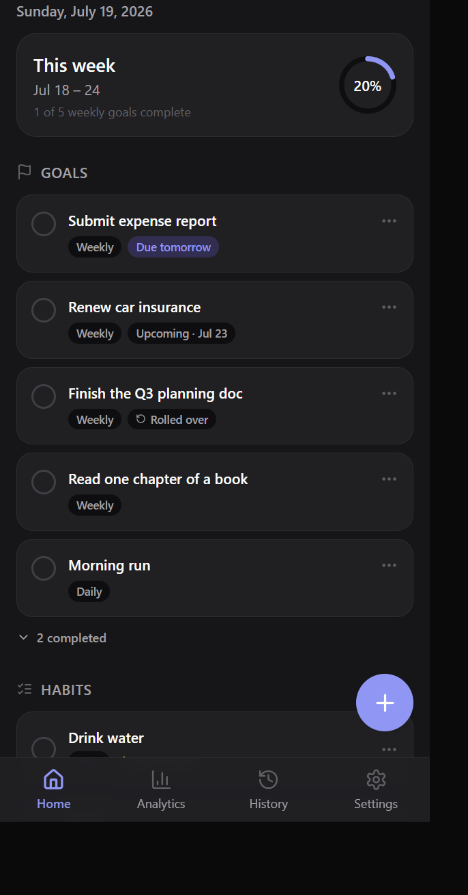
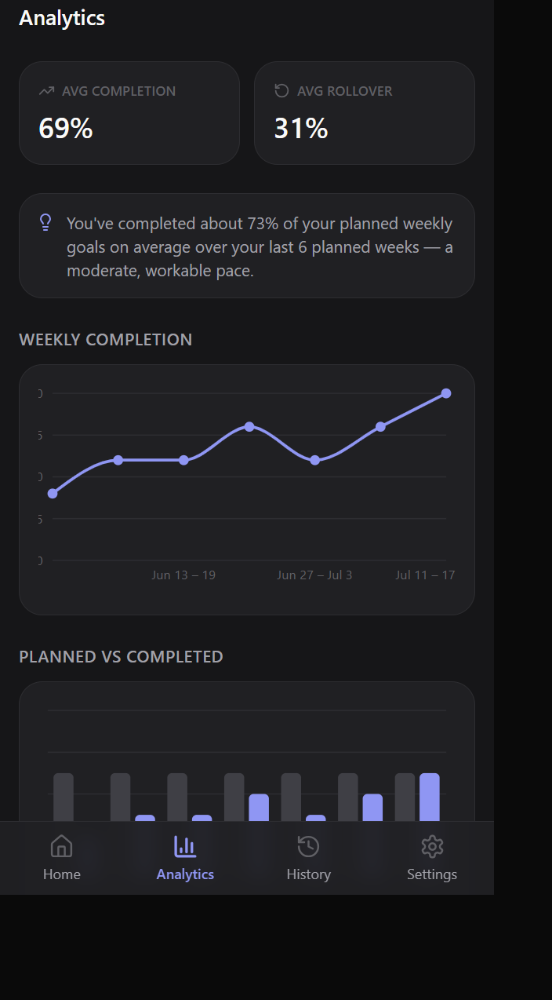
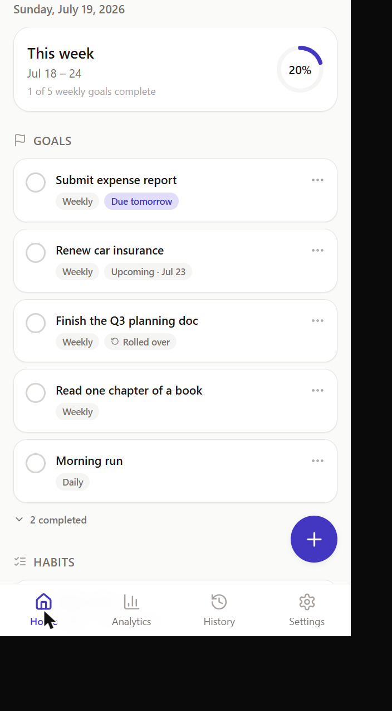

# Momentum

**A calm, offline-first PWA for goals, tasks, and habits — built around a custom Saturday–Friday planning week.**

[](LICENSE)
[](https://react.dev)
[](https://www.typescriptlang.org)
[](https://vitejs.dev)
[](#pwa-installation)

Momentum is a single-user personal productivity app: no accounts, no backend, no cloud. Every goal, task, habit, and analytics record lives in your browser's local storage, and the whole app works offline once it's loaded. It's designed to feel premium and unobtrusive — not like a generic admin dashboard — and to answer one question honestly: *are you planning a realistic week?*

---

## Use Momentum

### 👉 [**Open Momentum**](https://omar-issam-abdelhalim.github.io/momentum/)

That's it — **no download, no GitHub account, no sign-up, nothing to clone or install to just try it.** Open the link above in any modern browser (Chrome, Safari, Edge, Firefox) on your phone, tablet, or computer, and the app is ready to use immediately. Installing it as described below is optional and just makes it feel like a native app on your device.

#### Install on Android

1. Open the link above in **Chrome**.
2. Tap the **⋮** menu in the top right.
3. Tap **"Install app"** (or **"Add to Home screen"**).
4. Confirm — Momentum now appears as an app icon on your home screen and app drawer.

#### Add to Home Screen on iPhone / iPad

1. Open the link above in **Safari** (installation must be done from Safari on iOS).
2. Tap the **Share** icon (the square with an arrow pointing up) in the toolbar.
3. Scroll down and tap **"Add to Home Screen."**
4. Tap **"Add"** in the top right — Momentum now appears as an app icon on your home screen.

#### Install on desktop (Chrome, Edge)

1. Open the link above.
2. Click the **install icon** in the address bar (or the in-app "Install" banner near the bottom of the Home screen), then confirm.
3. Momentum opens in its own app window, separate from your browser tabs.

#### Just want to use it in the browser?

That works too — nothing above is required. Momentum runs fully in the browser tab with no loss of functionality; installing only adds a home-screen icon and a standalone window.

#### Already have Momentum installed?

If you installed Momentum before this release, you don't need to do anything — the service worker updates itself automatically in the background (`registerType: 'autoUpdate'`). The next time you open the app, it checks for a new version, downloads it silently, and activates it on that same open (or the next one, if the app was already open). You'll simply see the new version next time you use it — no reinstall, no data loss, no manual steps.

#### About your data

Momentum stores everything **locally on the device you're using** — there is no account and no server, so **your data is not automatically synced between your phone, tablet, and computer.** Each device has its own separate copy.

To move your data to another device, or to keep a backup, use **Settings → Export Backup** to save a JSON file, then **Settings → Import Backup** on the other device (or after reinstalling) to restore it.

---

## Contents

- [Use Momentum](#use-momentum)
- [Screenshots](#screenshots)
- [Key features](#key-features)
- [Technology stack](#technology-stack)
- [Architecture overview](#architecture-overview)
- [Getting started](#getting-started)
- [Available scripts](#available-scripts)
- [The custom week: Saturday → Friday](#the-custom-week-saturday--friday)
- [The goal/task system](#the-goaltask-system)
- [Scheduled Date vs. Deadline](#scheduled-date-vs-deadline)
- [Home priority order](#home-priority-order)
- [Completed this week](#completed-this-week)
- [Weekly Goals & rollover](#weekly-goals--rollover)
- [Habits & streaks](#habits--streaks)
- [Activity archive](#activity-archive)
- [Data retention](#data-retention)
- [Analytics](#analytics)
- [Local data storage & privacy](#local-data-storage--privacy)
- [Backup, export & import](#backup-export--import)
- [Offline-first behavior](#offline-first-behavior)
- [PWA installation](#pwa-installation)
- [Deploying for HTTPS access](#deploying-for-https-access)
- [Project structure](#project-structure)
- [Testing](#testing)
- [Build & quality checks](#build--quality-checks)
- [Limitations](#limitations)
- [License](#license)

---

## Screenshots

| Home (dark) | Analytics (dark) | Home (light) |
| :---: | :---: | :---: |
|  |  |  |

*(Screenshots predate the v2 redesign but the visual language is unchanged.)*

---

## Key features

- **Four clear task types** — Scheduled Task, Weekly Goal, Today Only, and Recurring Task — each with unambiguous rules for when it's relevant and what happens if it's missed.
- **Scheduled Date vs. Deadline as separate concepts** — "when I intend to start" and "the hard due date" are never conflated.
- **Late tracking** — a missed Scheduled Task or Recurring occurrence stays visible and clearly marked *Late · N days*, forever, until you complete or delete it.
- **A deliberate Home priority order** so today's plan and real urgency never fight each other — see [Home priority order](#home-priority-order).
- **Automatic weekly rollover** for Weekly Goals — incomplete ones move into the new week on their own, without ever being duplicated.
- **Recurring tasks** with a robust definition + independent-occurrence architecture: a missed Tuesday never blocks the next Tuesday's occurrence from being created.
- **Daily & weekly habits** with current/best streak tracking.
- **A real Activity archive** — completed items organized by Year → Month, kept in detail for about two years.
- **Analytics across six time ranges** — All, Week, Month, Quarter, Half-Year, Year — with navigation between periods.
- **Backup & restore** — export everything to a single JSON file, validate and re-import it later, with automatic migration from older backup versions.
- **Installable, fully offline PWA** — add it to your phone's home screen and use it with no network connection.
- **Light / dark / system theming**, designed intentionally for both, not just an inverted palette.

## Technology stack

| Layer | Choice |
| --- | --- |
| UI | React 18 + TypeScript, Vite |
| Styling | Tailwind CSS with custom design tokens (light/dark/system theming) |
| Local storage | [Dexie.js](https://dexie.org) over IndexedDB |
| Charts | [Recharts](https://recharts.org) (lazy-loaded — only fetched when Analytics is opened) |
| Dates | [date-fns](https://date-fns.org) + a hand-written Saturday–Friday week engine |
| Icons | [lucide-react](https://lucide.dev) |
| PWA | [vite-plugin-pwa](https://vite-pwa-org.netlify.app) (Workbox) — service worker, manifest, offline caching |
| Testing | [Vitest](https://vitest.dev), [fake-indexeddb](https://github.com/dumbmatter/fakeIndexedDB) for Dexie integration tests |

## Architecture overview

Business logic is deliberately layered and kept independent of React and of the database, so the rules that actually matter (date math, sorting, rollover, recurrence, retention, analytics) can be unit-tested in isolation:

```
lib/date    → pure calendar/week math (no I/O, no framework) + Analytics period math
lib/logic   → pure business rules built on lib/date: goal-kind semantics (Late, active,
              expired), priority sorting, recurrence-occurrence generation, deadline
              urgency, streaks, weekly-snapshot aggregation, retention eligibility
lib/db      → Dexie schema, repositories, and the startup orchestrators (rollover
              runner, recurring-occurrence runner, cleanup runner) that apply
              lib/logic against real data
hooks       → thin reactive wrappers (dexie-react-hooks' useLiveQuery) around lib/db
components  → presentational UI, screens compose components + hooks
```

Nothing above `lib/db` computes "what week is it," "is this Late," or "should this goal roll over" independently — everything routes through the same pure functions, which is what keeps rollover and recurrence generation idempotent and the analytics numbers trustworthy.

## Getting started

Requires Node.js 18+ and npm.

```bash
git clone https://github.com/omar-issam-abdelhalim/momentum.git
cd momentum
npm install
npm run dev
```

Open the printed `http://localhost:5173` URL. Vite also prints a `Network:` URL — open that from your phone while it's on the same Wi-Fi to test on a real device during development.

## Available scripts

```bash
npm run dev        # start the dev server
npm run build       # type-check (tsc -b) then production build to dist/
npm run preview     # serve the production build locally (also PWA-testable)
npm run test        # run the Vitest suite once
npm run test:watch  # run Vitest in watch mode
npm run typecheck   # tsc -b --noEmit
npm run lint        # eslint .
```

## The custom week: Saturday → Friday

Momentum's week is **not** Monday–Sunday or Sunday–Saturday — it's **Saturday 00:00:00 → Friday 23:59:59.999**, always in the device's local timezone. All week math is centralized in `src/lib/date/week.ts`; no other module computes "the current week" independently. This is covered by dedicated tests for the Friday→Saturday boundary, end-of-month, end-of-year, and a leap-year date.

## The goal/task system

Momentum has four task types, each with clear, distinct rules for when it's relevant and what happens if you miss it:

| Type | "Relevant when…" | If missed |
| --- | --- | --- |
| **Scheduled Task** | its Scheduled Date arrives | stays active, marked **Late** with a day count, until completed or deleted |
| **Weekly Goal** | anytime during its custom week | the same goal **rolls over** into the next week automatically |
| **Today Only** | only on its one assigned day | quietly stops being active the next day — never Late, never rolled forward |
| **Recurring Task** | each generated occurrence's day arrives | that occurrence behaves exactly like a Scheduled Task (stays active and Late) — the *next* occurrence still generates independently and on time |

**Recurring Tasks** are built as a recurrence **definition** (daily, or specific weekday(s)) plus independently generated **occurrences** — not one record that gets mutated. That's what lets a missed Tuesday stay visibly Late while the following Tuesday's occurrence still shows up right on schedule, with no risk of the two ever overwriting each other. Occurrence generation runs at startup and is idempotent: reopening the app never creates a duplicate occurrence for a day it has already generated.

## Scheduled Date vs. Deadline

These are two separate concepts and Momentum never conflates them:

- **Scheduled Date** — *when you intend to start.* Available on Scheduled Tasks (required) and, indirectly, on Recurring occurrences (generated automatically).
- **Deadline** — *the hard due date.* Optional, and available on Scheduled Tasks and Weekly Goals.

A task can have a Scheduled Date only, a Deadline only, both, or neither (Weekly Goals commonly have neither). Example: *"Study Lecture"* scheduled for Monday with a Thursday deadline becomes relevant Monday, turns **Late** on Tuesday if untouched, and its Thursday deadline still governs the hard cutoff regardless of how Late it already is.

## Home priority order

A task scheduled for **today** matters more than a deadline that's still in the future — but once a deadline reaches **today** or becomes **overdue**, the deadline takes over. Home sorts every active item into one ordered bucket:

1. **Overdue deadline** (most overdue first)
2. **Deadline today**
3. **Late Scheduled/Recurring** (oldest scheduled date first)
4. **Scheduled for today** (Scheduled Task, Recurring occurrence, or Today Only)
5. **Upcoming deadline** (nearest first)
6. **Rolled-over Weekly Goal** (oldest original week first)
7. **Regular Weekly Goal**
8. *(fallback: anything uncategorized)*

Ties within a bucket always resolve to creation order, so the list never reshuffles unpredictably. Late items, deadline-today items, and rolled-over items are each visually badged so the reason something is near the top is always obvious at a glance.

## Completed this week

Finishing a goal or task keeps it visible in Home's collapsed **Completed** section for the rest of the *custom week you completed it in* — regardless of which day within that week it was finished, and regardless of how Late it originally was. When the next custom week begins, that item quietly drops off Home (it is **never deleted**) and becomes available in [Activity](#activity-archive) instead.

## Weekly Goals & rollover

Weekly Goals are sorted with the priority rules above; a rolled-over Weekly Goal and its `rolloverCount` are always visible. When a week closes, any still-incomplete Weekly Goal is carried into the next week automatically the next time the app is opened. The rollover **mutates the same goal record in place** — it is never copied — so `rolloverCount` and `originalWeekId` always tell you exactly how long a goal has been outstanding, and re-running rollover (or missing several weeks in a row) can never produce duplicates. Each closed week also gets a permanent, detailed `WeeklySnapshot` — covering Weekly Goals, Scheduled Tasks, Today Only, Recurring, and deadline performance — which is what powers Analytics and Activity long after the underlying detail rows are gone.

## Habits & streaks

Habits are daily or weekly. Daily habits reset at local midnight; weekly habits reset every Saturday. Streaks are computed from the underlying completion events (not a counter that can drift): a streak counts consecutive completed periods ending at "now," and isn't broken just because the *current* period hasn't been completed yet — only a genuinely missed prior period breaks it.

## Activity archive

Activity is Momentum's long-term completion record, organized hierarchically:

```
Completed
  → 2026
     → July      (12 completed)
     → June      (9 completed)
  → 2025
     → December  (…)
```

Years and months are collapsible, with the current year and month open by default. Each entry shows the task's type, when it was completed, its scheduled date and/or deadline where relevant, whether it was completed late, and rollover history for Weekly Goals — without turning the screen into an admin table.

## Data retention

Detailed task records are retained for a deterministic **~2 calendar-year window**: a record belonging to year *Y* stays available throughout *Y* and *Y + 1*, and becomes eligible for cleanup once year *Y + 2* begins (e.g. a 2026 completion is purged once 2028 begins). This applies to completed items of any type, and to missed Today Only tasks (keyed off their assigned day). It is **never** applied to anything still active: an incomplete Scheduled Task, Recurring occurrence, or Weekly Goal is kept indefinitely no matter how old, since it may still be genuinely outstanding (Late).

Before any detailed record is removed, its contribution to that week's aggregate stats has already been folded permanently into a `WeeklySnapshot` — snapshots, recurring-task definitions, and habit completions are never deleted automatically, so long-term Analytics stays accurate even as detail rows age out.

## Analytics

Analytics supports six time ranges — **All, Week, Month, Quarter, Half-Year, Year** — with previous/next navigation for every range except All. "Week" is the custom Saturday–Friday week; a custom week that spans a month boundary is attributed to the month it *starts* in for Month/Quarter/Half-Year/Year rollups.

For the selected range:

- **Completion, by type** — Weekly Goals, Scheduled Tasks, Today Only, Recurring — planned vs. completed, with missed counts.
- **Rollover rate** for Weekly Goals.
- **Deadline performance** — met on time, met late, and overdue/missed count.
- **Average lateness**, in days, across Scheduled and Recurring completions that finished late.
- **Weekly completion trend & planned-vs-completed charts**, plotted over the most recent weeks regardless of the selected range.
- **Rule-based planning-realism insights** — plain, factual observations (e.g. *"you're completing about X% of planned goals on average"*), never psychological or medical framing.
- **Habit consistency** — per-habit completion rate over a trailing window, plus current/best streaks.

A rate is only ever shown when the underlying denominator is non-zero — Momentum shows "—" rather than a fabricated percentage when there's nothing to measure yet.

## Local data storage & privacy

Everything — goals/tasks, recurring-task definitions, habits, completions, weekly snapshots, settings — lives in **IndexedDB** on your device via Dexie. Nothing is ever sent to a server; there is no backend. Theme preference is additionally mirrored into `localStorage` purely so the app can apply the correct theme before first paint (IndexedDB reads are inherently async); IndexedDB remains the source of truth and is what backups export.

## Backup, export & import

Settings → **Export backup** downloads a timestamped, schema-versioned JSON file. **Import backup** validates the file's structure before touching anything; on a valid file it asks for confirmation, then replaces all local data with the backup's contents. Backups exported from the original v1 release are still importable — they're automatically migrated to the current schema (a v1 "Daily" goal maps to today's **Today Only** type, since that's exactly how it already behaved). Import still replaces rather than merges — the safer choice with no conflict-resolution UI yet.

## Offline-first behavior

Once loaded, Momentum works fully offline: viewing, adding, completing, editing, and deleting goals, tasks, and habits, and viewing locally available analytics, all work with no network connection. This is backed by a Workbox-generated service worker that precaches the app shell — verified by killing the server entirely and confirming the app still loads fully from cache with existing data intact.

## PWA installation

The app ships as a fully configured installable PWA (manifest, service worker, offline app-shell caching).

- **Desktop Chrome/Edge**: an install icon appears in the address bar, or use the in-app "Install" banner that appears near the bottom of the Home screen (dismissible, unobtrusive, only shown when the browser reports the app is installable).
- **Android Chrome**: menu → "Install app" / "Add to Home screen".
- **iOS Safari**: Share → "Add to Home Screen" (iOS doesn't support the install-prompt event, so this step is manual).

Already-installed users receive new releases automatically through the service worker's `autoUpdate` registration — no reinstall needed; see [Already have Momentum installed?](#already-have-momentum-installed) above.

To test on your phone during development, run `npm run dev`, make sure your phone is on the same Wi-Fi as your computer, and open the `Network:` URL Vite prints. For a real installable experience you'll want HTTPS — see below.

## Deploying for HTTPS access

The live app at **https://omar-issam-abdelhalim.github.io/momentum/** is deployed on **GitHub Pages**, built and published automatically by the GitHub Actions workflow at [`.github/workflows/deploy.yml`](.github/workflows/deploy.yml) on every push to `main`. That workflow runs the full check suite (typecheck, lint, tests) before building, so a broken change never reaches production.

The app is a static build with no backend, so any static HTTPS host works if you want to deploy your own fork:

```bash
npm run build
# deploy the contents of dist/ to Netlify, Vercel, Cloudflare Pages, a custom domain, etc.
```

No environment variables or server configuration are required for a root-domain deploy. GitHub Pages is the one exception: since a GitHub Pages *project* site is served from a subpath (`https://<user>.github.io/<repo>/`, not the domain root), the build needs to know that ahead of time so the PWA manifest, service worker scope, and asset URLs all agree — that's what the `GITHUB_PAGES=true npm run build` step in the CI workflow does (see the `base` logic in `vite.config.ts`). Building normally (`npm run build`, no env var) targets the domain root and is correct for every other host.

Once deployed, open the HTTPS URL on your phone and install it from there — that installation's data is separate from any other device (local storage is per-device); use Export/Import in Settings to move data between them.

## Project structure

```
src/
  config/app.config.ts      # app name/version/schema version — the one place to rebrand the UI
  types/models.ts           # Goal, RecurringDefinition, Habit, HabitCompletion, WeeklySnapshot, AppSettings
  lib/
    date/week.ts             # the Saturday–Friday custom week engine
    date/ranges.ts           # Analytics period math (Month/Quarter/Half-Year/Year/All)
    date/format.ts           # display-only date formatting helpers
    db/                      # Dexie schema + repositories (goals, recurring definitions, habits,
                              #   settings, snapshots)
    db/rolloverRunner.ts      # idempotent weekly rollover, run at startup
    db/recurringRunner.ts     # idempotent recurring-occurrence generation, run at startup
    db/cleanupRunner.ts       # ~2-calendar-year detailed-record retention cleanup, run at startup
    logic/                    # pure, unit-tested business rules:
                               #   goalKind (Late/active/expired semantics), goalSort (Home priority),
                               #   recurrence (occurrence-date generation), deadline urgency, streaks,
                               #   rollover/snapshot aggregation, retention eligibility, analytics
    backup/backup.ts          # export/import/validate JSON backups, incl. v1 -> v2 migration
    seed/seedData.ts          # dev-only sample data (never runs automatically)
  hooks/                     # useGoals, useHabits, useTheme, useAppInit (reactive Dexie queries)
  components/                # ui/ primitives, goals/, habits/, layout/ (nav, install prompt)
  screens/                   # HomeScreen, AnalyticsScreen, HistoryScreen (Activity), SettingsScreen
  App.tsx, main.tsx
```

## Testing

```bash
npm run test
```

The suite (Vitest) covers the business logic that actually matters to get right: custom week boundaries (including the Friday 23:59 → Saturday 00:00 transition, end-of-month, end-of-year, and a leap-year date), Late/active/expired goal-kind semantics, Home priority sorting (including the worked examples in this README), recurrence-occurrence generation and its idempotency, weekly rollover idempotency and multi-week-gap handling (via `fake-indexeddb`, exercising the real Dexie code path), the IndexedDB v1 → v2 schema migration against a real seeded legacy database, retention-eligibility rules, Analytics time-range aggregation, and backup validation/migration/round-tripping.

## Build & quality checks

```bash
npm run typecheck   # tsc -b --noEmit
npm run lint         # eslint .
npm run test          # vitest run
npm run build          # production build
```

All four are expected to pass cleanly before any change is considered done.

## Limitations

- No cloud sync — data is per-device; use Export/Import to move it between devices.
- Import replaces all local data rather than merging with existing data.
- Analytics reflects weeks the app has actually tracked through; a task manually backdated to a calendar week before the app was first opened (or before that week was ever "seen") won't retroactively appear in weekly aggregates — it remains fully functional and visible on Home either way.
- No calendar-heatmap habit view (kept out as a nice-to-have).
- App icons are generated placeholder monograms, not custom artwork.

## License

Released under the [MIT License](LICENSE) © Omar Issam.
